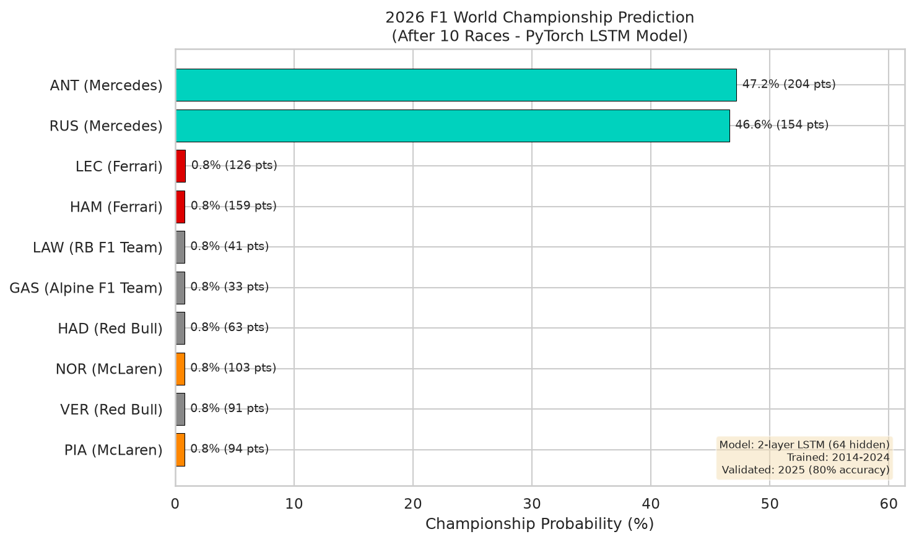
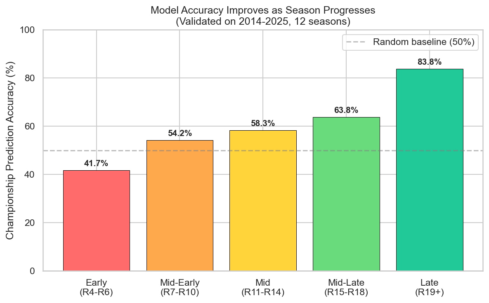

# F1 Championship Prediction with PyTorch LSTM

Predicting the 2026 F1 World Championship winner using a PyTorch LSTM model trained on 12 seasons of historical data (2014-2025).

## Key Results

**2026 Prediction (After 6 Races):**

| Driver | Team | Points | Championship Probability |
|--------|------|--------|--------------------------|
| RUS | Mercedes | 80 | 36.5% |
| ANT | Mercedes | 100 | 36.3% |
| LEC | Ferrari | 59 | 7.9% |
| HAM | Ferrari | 51 | 4.5% |
| NOR | McLaren | 51 | 2.8% |

**Model sees a 73% chance a Mercedes driver wins 2026.**

**Model Performance:**
- Validated on 2025 season: **80% championship prediction accuracy**
- Late-season accuracy (R19+): **83.8%**
- Correctly predicts dominant champions (2015, 2016, 2023, 2024): **100%**



## Problem Statement

After N races in an F1 season, can we predict who wins the World Championship? This is a sequential prediction problem - a driver's championship trajectory (points, wins, momentum) over multiple races forms a time series that an LSTM can learn from.

**Training Data:** 2014-2024 (11 complete seasons, ~240 races)  
**Validation:** 2025 season (tight 3-way fight: Norris 394 vs Verstappen 389 vs Piastri 381)  
**Prediction:** 2026 season (6 races completed, Antonelli leads with 100 pts)

## Model Architecture

```
Input: (batch, seq_len, 12 features)
  ├─ Points normalized, Position, Gap to leader
  ├─ Win rate, Podium rate, Points per race
  ├─ Season progress, Consistency
  └─ Momentum, Is leader, Points share, Recent form
            ↓
LSTM Layer 1: (input=12, hidden=64)
            ↓
LSTM Layer 2: (input=64, hidden=64) + Dropout(0.3)
            ↓
Linear: (64 → 1)
            ↓
Sigmoid → Championship Probability (0-1)

Parameters: 53,313
Loss: BCEWithLogitsLoss (pos_weight=9 for class imbalance)
```

## Accuracy by Season Progress

The model improves as more races are completed:



| Season Stage | Accuracy |
|-------------|----------|
| Early (R4-R6) | 41.7% |
| Mid-Early (R7-R10) | 54.2% |
| Mid (R11-R14) | 58.3% |
| Mid-Late (R15-R18) | 63.8% |
| Late (R19+) | 83.8% |

## Historical Validation (2014-2025)

| Season | Champion | Accuracy | Notes |
|--------|----------|----------|-------|
| 2014 | HAM | 0% | ROS led early, HAM won late |
| 2015 | HAM | 100% | Dominant from start |
| 2016 | ROS | 100% | Led from start |
| 2017 | HAM | 6% | VET led early, HAM comeback |
| 2018 | HAM | 33% | VET led first half |
| 2019 | HAM | 72% | Came from behind after R8 |
| 2020 | HAM | 79% | Came from behind after R4 |
| 2021 | VER | 32% | HAM led most, VER won Abu Dhabi |
| 2022 | VER | 11% | LEC led early, VER dominant later |
| 2023 | VER | 100% | Dominant from start |
| 2024 | VER | 100% | Dominant from start |
| 2025 | NOR | 81% | Led most, PIA took lead mid-season, NOR recovered |

**Pattern:** Model excels at predicting dominant champions but struggles with comeback seasons.

## Project Structure

```
f1-championship-prediction/
├── data/
│   ├── championship_standings.csv    # Race-by-race standings (2014-2026)
│   └── race_results.csv             # Raw race results
├── notebooks/
│   └── championship_prediction.ipynb # Full analysis notebook
├── src/
│   ├── data_collection.py           # FastF1 API data collection
│   ├── feature_engineering.py       # 12 sequential features
│   ├── dataset.py                   # PyTorch Dataset & DataLoader
│   ├── model.py                     # LSTM architecture
│   ├── train.py                     # Training loop
│   ├── evaluate.py                  # Historical validation
│   └── visualize.py                 # Generate plots
├── models/
│   └── best_model.pth               # Trained model checkpoint
├── results/
│   ├── 2026_prediction.png
│   ├── accuracy_by_progress.png
│   ├── season_timelines.png
│   ├── training_curves.png
│   ├── model_architecture.png
│   ├── training_history.json
│   ├── evaluation_results.json
│   └── config.json
├── requirements.txt
├── .gitignore
└── README.md
```

## Features (12 per time step)

| # | Feature | Description |
|---|---------|-------------|
| 1 | Points normalized | Cumulative points / max possible at this stage |
| 2 | Position normalized | Championship standing (1 = best → 1.0) |
| 3 | Gap to leader | Distance to P1 (0 = is leader) |
| 4 | Win rate | Wins / races completed |
| 5 | Podium rate | Podiums / races completed |
| 6 | Points per race | Consistency metric normalized |
| 7 | Season progress | Current round / total rounds |
| 8 | Consistency | 1 - DNF rate |
| 9 | Momentum | Change in PPR vs previous race |
| 10 | Is leader | Binary: currently P1 in championship |
| 11 | Points share | Fraction of total possible points |
| 12 | Recent form | Points scored this race / max per race |

## How to Run

```bash
# Install dependencies
pip install -r requirements.txt

# Option 1: Run the notebook (recommended)
jupyter notebook notebooks/championship_prediction.ipynb

# Option 2: Run individual scripts
python src/data_collection.py          # Collect data from FastF1 API
python src/train.py                    # Train model
python src/evaluate.py                 # Evaluate + predict 2026
python src/visualize.py                # Generate plots
```

**Note:** Data collection requires FastF1 API access (rate limited to 500 calls/hour). The pre-collected CSV files in `data/` are included so you can skip this step.

## Insights

### Why 2025 Was Special
The 2025 championship was decided by just 13 points between three drivers:
- Norris (394 pts, 7 wins) - Champion
- Verstappen (389 pts, 8 wins)
- Piastri (381 pts, 7 wins)

Piastri led from Race 12-17, but Norris recovered in the final stretch. The model correctly predicted Norris for 81% of the season despite this mid-season lead change.

### What the Model Learned
- **Consistency matters more than raw wins** (Norris won with fewer wins than Verstappen)
- **Early dominance usually holds** (leader after R6 won 67% of championships historically)
- **Mercedes dominance pattern** (2026 looks similar to Mercedes 2014-2016 era)

### Limitations
- Struggles with comeback seasons (2014, 2017, 2022)
- Trained on era of dominant champions (Hamilton/Verstappen monopoly)
- Individual driver features only (no team dynamics or car development modeling)

## Future Work

- Update predictions after each new 2026 race
- Add inter-driver comparison features
- Implement attention mechanism for weighting recent form
- Constructor championship prediction (parallel model)
- Multi-season trajectory modeling (3-5 year outlook)

## Tech Stack

- **PyTorch** - LSTM model, custom Dataset, packed sequences for variable-length input
- **FastF1** - Official F1 timing data API
- **pandas / numpy** - Data processing and feature engineering
- **matplotlib / seaborn** - Visualization
- **scikit-learn** - Preprocessing utilities
